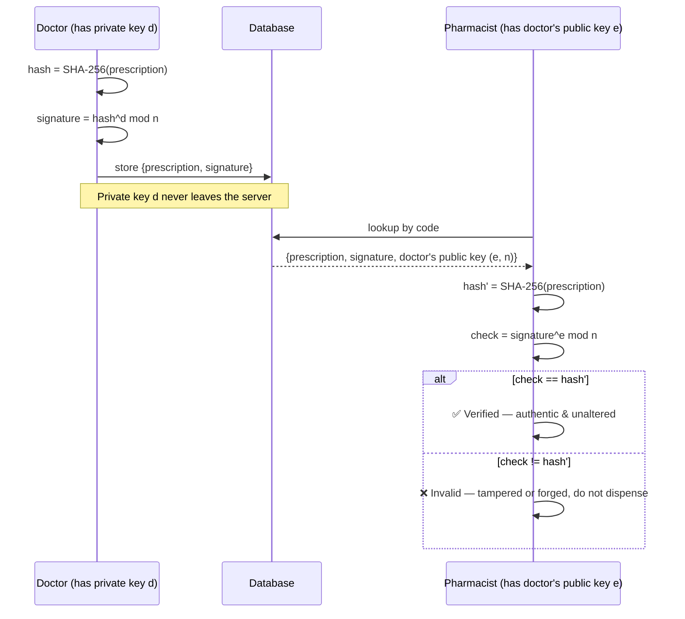
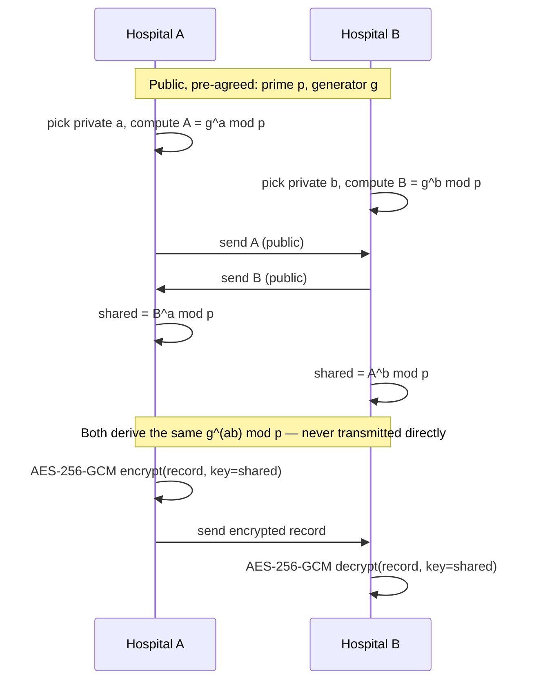

# SwasthoLink — Secure e-Prescription & Medical Record System

**© 2026 Salah Uddin. All Rights Reserved.**
This is a personal academic project. It is **not open source** — see [License](#license) below before reusing, copying, or redistributing any part of this code.

A computer security course project built with **Laravel (PHP)**, **Tailwind CSS**, and **MySQL**, demonstrating proper authentication and applied cryptography (RSA digital signatures, Diffie–Hellman key exchange, and password hashing).

> Project tracking: see [`PROJECT_OVERVIEW.md`](PROJECT_OVERVIEW.md) for what's built and the running change log, and [`TODO.md`](TODO.md) for the open task list and bug history. Product/design decisions are recorded in [`PRODUCT.md`](PRODUCT.md) and [`DESIGN.md`](DESIGN.md).

## The Problem (Bangladesh context)

Prescriptions and medical records in Bangladesh are still mostly paper-based or shared as unsigned digital copies (WhatsApp photos, plain PDFs/photocopies). This makes them easy to forge — fake prescriptions for restricted drugs are a known issue at pharmacies — and records shared between hospitals/labs/clinics have no real integrity or confidentiality guarantee in transit. Most medicine purchases also happen **offline, at a physical pharmacy counter** — so any solution has to work for a patient who just walks in and talks to the person behind the counter, not one who opens an app together with the pharmacist. SwasthoLink is designed around that reality.

## Trust Model — Who Is Actually Trusted, and Why

This is the part that makes the crypto meaningful instead of decorative. SwasthoLink uses a three-tier chain of trust, similar to how real-world PKI certificate chains work:

```
Admin (platform / root of trust)
   │  verifies legal registration documents
   ▼
Hospital / Clinic (organizational account)
   │  verifies staff doctor's BMDC registration
   ▼
Doctor (individual account, affiliated with a hospital)
```

- **Admin** is the root: manually verifies a hospital/clinic's legal registration (trade license, DGHS registration) before approving it.
- **Hospital/Clinic** accounts, once approved, get their own RSA keypair and can approve doctors who work there.
- **Doctor** accounts submit their **BMDC (Bangladesh Medical & Dental Council) registration number** plus supporting documents (BMDC certificate, NID) at signup. The account sits in `pending` status — **it cannot create or sign prescriptions yet**. An Admin (or an affiliated Hospital admin) manually checks the BMDC number/documents before approving. Only on approval does the system generate the doctor's RSA keypair and activate the account.
- Independent doctors (not affiliated with a hospital) can still register directly with Admin approval — the hospital layer is optional, not mandatory.

**Why this matters:** no software can currently auto-confirm "this person is a licensed doctor" — that has to be a human verification step against BMDC records. The RSA signature doesn't replace that check; it makes the *result* of that check (this prescription really came from a verified doctor, unaltered) provable after the fact, to anyone, without re-checking BMDC every time.

## What We're Building

Five account types:

- **Admin** — root of trust; approves hospitals and independent doctors.
- **Hospital/Clinic** — organizational account; approves its own affiliated doctors; can securely exchange patient records with other hospitals.
- **Doctor** — writes prescriptions. Every prescription is hashed and **signed with the doctor's RSA private key**, so forgery or tampering becomes detectable.
- **Patient** — owns their prescriptions/records; can share a record with another hospital/doctor, and gets a short lookup code for each prescription (see below).
- **Pharmacist** — verified staff account at a pharmacy; looks up a prescription by code and the system verifies its signature automatically before it's dispensed.

## The Offline Pharmacy Flow (the "unique code" idea)

Since most medicine buying happens face-to-face at a counter, prescriptions don't rely on the patient's phone or an app at the point of sale:

1. When a doctor signs a prescription, the system generates a **short, memorable lookup code** (e.g. `RX-482917`), tied to that specific signed record. It's printed on a slip and/or sent by SMS — a QR code is included too, as an optional scan-instead-of-type shortcut.
2. At the pharmacy, the patient just **tells the pharmacist the code** — no app needed on the patient's side.
3. The pharmacist (logged into their own verified account) types the code into a **Lookup Prescription** screen.
4. The system automatically recomputes the prescription hash and verifies the RSA signature against the doctor's stored public key, then shows a clear result: ✅ *Verified — Dr. X, BMDC #12345, [medicine list]* or ❌ *Invalid / Tampered — do not dispense*. The pharmacist never has to understand the crypto; they just see the verdict.
5. Safeguards on the code itself:
   - **Expiry** (e.g. 30 days) and **single/limited use** — once dispensed, the code is marked used so it can't be replayed to refill restricted drugs.
   - **Second factor at lookup** — pair the code with something like the patient's phone last 4 digits or date of birth, so a code alone isn't enough to pull up someone's medical info if it's overheard or found on a discarded slip.
   - **Every lookup is audit-logged** (which pharmacist, which code, when) for accountability.

Digital-to-digital sharing (a hospital sending a patient's history to another hospital/lab) is a different, separate flow — that's where Diffie–Hellman comes in, described below.

## How the Required Crypto Maps to Real Features

| Requirement | Where it's used | What it protects against |
|---|---|---|
| **Password hashing** | Laravel's built-in Bcrypt/Argon2id hashing for every user account | Plaintext password exposure if the DB leaks |
| **RSA** | Digital signatures on prescriptions — doctor signs the prescription hash with their private key; pharmacists/patients verify it with the doctor's public key. Hospitals get their own keypair too, for signing reports and vouching for affiliated doctors | Forged prescriptions, tampering, denies a doctor the ability to disown a prescription they actually wrote (non-repudiation) |
| **Diffie–Hellman** | Key agreement between two *organizational* accounts (hospital ↔ hospital, or hospital ↔ lab) when sharing a patient's full record digitally; the derived shared secret becomes an AES-256-GCM key that encrypts the record before it's stored/sent | Eavesdropping on shared medical data, even if the transport layer (TLS) were somehow compromised — defense in depth |

Pages that exist specifically to make the crypto visible for demo/grading purposes:
- **Verify Prescription / Lookup by Code** — shows the hash recomputation and RSA signature check step-by-step, with a clear pass/fail explanation.
- **Secure Share** — shows the Diffie–Hellman public-value exchange between two hospital accounts and confirms both sides derive the same session key before a record is encrypted.

## Cryptography Deep Dive — The Actual Math

This section exists because a security course project should be able to show *why* the crypto works, not just that a library was called. Both algorithms below are implemented with real, production-sized parameters in the app (via `phpseclib3` / PHP's `openssl_*`) — the numbers used here are deliberately tiny so the arithmetic is checkable by hand; real keys use 2048+ bit RSA moduli and standard DH groups (e.g. RFC 3526), not two-digit primes.

### RSA — Digital Signatures on Prescriptions

RSA relies on one hard problem: given a large number `n` that is the product of two primes, it's computationally infeasible to recover those primes (factor `n`) if they're large enough — but it's easy to multiply them together in the first place. Key generation exploits that asymmetry.

**1. Key generation** (done once, when a Doctor/Hospital is approved):

$$
\begin{aligned}
&\text{Pick two large primes } p, q \\
&n = p \times q \\
&\varphi(n) = (p-1)(q-1) &&\text{(Euler's totient of } n \text{)} \\
&\text{Pick } e \text{ such that } 1 < e < \varphi(n) \text{ and } \gcd(e, \varphi(n)) = 1 \\
&d \equiv e^{-1} \pmod{\varphi(n)} &&\text{(modular inverse of } e\text{)}
\end{aligned}
$$

- **Public key:** $(e, n)$ — this is what gets stored in `doctor_profiles.rsa_public_key` / `hospitals.rsa_public_key` and handed to anyone who needs to verify.
- **Private key:** $(d, n)$ — stored encrypted at rest (`rsa_private_key_encrypted`), never leaves the server, never appears in any API response.

**2. Signing a prescription** (Doctor, at creation time):

$$
h = \text{SHA-256}(\text{prescription content}), \qquad s = h^{d} \bmod n
$$

The prescription's content is hashed first (never sign raw data directly), then the hash is raised to the private exponent `d` mod `n`. The result `s` is the signature, stored alongside the prescription.

**3. Verifying a prescription** (automatic, at pharmacist lookup):

$$
h' = s^{e} \bmod n \overset{?}{=} \text{SHA-256}(\text{prescription content})
$$

Anyone with the doctor's *public* key can raise the signature to `e` mod `n` and check it matches a fresh hash of the content. If the content was altered by even one character, the hash won't match and verification fails — that's the tamper-evidence property. If the signature wasn't produced with the matching private key, it won't match either — that's the authenticity property.

**Why it works — a tiny worked example** (toy primes, not secure sizes — for illustration only):

$$
\begin{aligned}
p &= 61, \quad q = 53 \\
n &= 61 \times 53 = 3233 \\
\varphi(n) &= 60 \times 52 = 3120 \\
e &= 17 \quad (\gcd(17, 3120) = 1) \\
d &= 17^{-1} \bmod 3120 = 2753
\end{aligned}
$$

To sign a message hash of, say, $h = 65$, using the **private** exponent $d = 2753$:

$$
s = 65^{2753} \bmod 3233 = 588
$$

To verify, anyone with the **public** exponent $e = 17$ checks:

$$
588^{17} \bmod 3233 = 65 = h \quad \checkmark
$$

The signer used $d$ (private) to produce `s`; anyone can use $e$ (public) to recover `h` from `s` and compare it to a freshly computed hash — without ever needing to know $d$, $p$, or $q$. (This works because $e$ and $d$ are modular inverses mod $\varphi(n)$: raising to $d$ then to $e$ returns the original value, by Euler's theorem.)



### Diffie–Hellman — Key Exchange for Hospital-to-Hospital Record Sharing

Diffie–Hellman lets two parties agree on a shared secret over a channel an eavesdropper can see *completely* — without ever transmitting the secret itself. It relies on a different hard problem: given $g$, $p$, and $g^a \bmod p$, it's computationally infeasible to recover $a$ (the discrete logarithm problem) when $p$ is large.

**1. Public parameters** (agreed in advance, not secret): a large prime $p$ and a generator $g$.

**2. Each side picks a private value and computes a public value:**

$$
\begin{aligned}
\text{Hospital A: pick private } a \implies A = g^{a} \bmod p \\
\text{Hospital B: pick private } b \implies B = g^{b} \bmod p
\end{aligned}
$$

$A$ and $B$ are exchanged over the network in the open — an eavesdropper can see both.

**3. Both sides independently compute the same shared secret:**

$$
\text{Hospital A computes: } B^{a} \bmod p = (g^{b})^{a} \bmod p = g^{ab} \bmod p
$$

$$
\text{Hospital B computes: } A^{b} \bmod p = (g^{a})^{b} \bmod p = g^{ab} \bmod p
$$

Both arrive at $g^{ab} \bmod p$ — identical — without either side ever sending $a$, $b$, or the secret itself over the wire. That shared value then becomes the key for AES-256-GCM, which actually encrypts the patient record payload before it's transmitted/stored.

**Tiny worked example:**

$$
p = 23, \quad g = 5
$$

$$
\begin{aligned}
\text{Hospital A: } a = 6 &\implies A = 5^{6} \bmod 23 = 8 \\
\text{Hospital B: } b = 15 &\implies B = 5^{15} \bmod 23 = 19
\end{aligned}
$$

Exchange $A = 8$ and $B = 19$ in the open. Now:

$$
\text{A computes: } 19^{6} \bmod 23 = 2, \qquad \text{B computes: } 8^{15} \bmod 23 = 2
$$

Both land on shared secret $2$ — an observer who saw $p=23$, $g=5$, $A=8$, $B=19$ cannot feasibly recover $6$, $15$, or $2$ without solving a discrete log (trivial at this toy size, computationally infeasible at real key sizes of 2048+ bits).



### Why These Two Together

RSA and Diffie–Hellman solve different problems and are used for different things in this app — this is deliberate, not redundant:

| | Solves | Used for |
|---|---|---|
| **RSA** | Authenticity + non-repudiation: proving *who* signed something and that it wasn't altered | Prescription signing (one-to-many verification — anyone can check a doctor's signature) |
| **Diffie–Hellman** | Confidentiality: establishing a shared secret between exactly two parties over an open channel | Hospital-to-hospital record sharing (a session key for one specific conversation) |

## General Security Practices Included

- CSRF protection on all forms (Laravel default)
- Blade auto-escaping to prevent XSS
- Eloquent parameterized queries everywhere (no raw SQL string concatenation) to prevent SQL injection
- Rate limiting on login, lookup-code, and verification endpoints (to prevent code-guessing/brute force)
- RSA private keys encrypted at rest, never exposed via any API response
- Secure session cookies, session regeneration on login
- Authorization checks (Policies) on every prescription/record route to prevent one user from accessing another's data (no IDOR)
- Full audit log of sensitive actions (logins, signing, verification, code lookups, sharing)
- Manual document/ID verification gate before any Doctor or Hospital account can act (BMDC number + documents, legal registration)

## Tech Stack

- **Backend**: Laravel (PHP), Breeze/Fortify for auth scaffolding
- **Frontend**: Blade templates + Tailwind CSS
- **Database**: MySQL/MariaDB via Eloquent ORM
- **Crypto**: PHP `openssl_*` functions for RSA keygen/sign/verify, `phpseclib3` for Diffie–Hellman, `openssl_encrypt`/`openssl_decrypt` (AES-256-GCM) for the DH-derived symmetric key

## Project Structure

Only files that make up this project's actual work are listed — Laravel's own framework internals (`vendor/`, `bootstrap/cache/`, etc.) are omitted since they're generated, not hand-written.

```
SwasthoLink/
├── app/
│   ├── Http/
│   │   ├── Controllers/
│   │   │   ├── Admin/
│   │   │   │   ├── ApprovalController.php      # approve/reject hospitals, doctors, pharmacists
│   │   │   │   ├── DashboardController.php     # Admin stats overview
│   │   │   │   └── DocumentController.php      # secure, audit-logged verification-document viewer
│   │   │   ├── Auth/
│   │   │   │   ├── RegisteredDoctorController.php
│   │   │   │   ├── RegisteredHospitalController.php
│   │   │   │   ├── RegisteredPharmacistController.php
│   │   │   │   └── RegisteredUserController.php    # patient registration (Breeze default, adapted)
│   │   │   ├── HospitalDashboardController.php
│   │   │   ├── PrescriptionController.php          # create / list / lookup / dispense
│   │   │   └── ProfileController.php               # account settings (deletion restricted to patients)
│   │   └── Middleware/
│   │       └── EnsureUserHasRole.php                # role + active-status route gating
│   └── Models/
│       ├── AuditLog.php
│       ├── DoctorProfile.php
│       ├── Hospital.php
│       ├── PharmacistProfile.php
│       ├── Prescription.php
│       └── User.php
├── database/
│   ├── migrations/
│   │   ├── ..._add_role_and_status_to_users_table.php
│   │   ├── ..._create_hospitals_table.php
│   │   ├── ..._create_doctor_profiles_table.php
│   │   ├── ..._create_pharmacist_profiles_table.php
│   │   ├── ..._create_audit_logs_table.php
│   │   └── ..._create_prescriptions_table.php
│   ├── seeders/
│   │   └── DatabaseSeeder.php       # seeds the default Admin account
│   └── sql/
│       └── swastholink.sql          # full schema + seeded Admin — importable directly into MySQL
├── resources/views/
│   ├── admin/
│   │   ├── approvals.blade.php
│   │   └── dashboard.blade.php
│   ├── auth/
│   │   ├── register.blade.php
│   │   ├── register-doctor.blade.php
│   │   ├── register-hospital.blade.php
│   │   └── register-pharmacist.blade.php
│   ├── components/                  # buttons, inputs, nav-link — brand color tokens applied
│   ├── doctor/prescriptions/
│   │   ├── create.blade.php
│   │   └── index.blade.php
│   ├── hospital/
│   │   └── dashboard.blade.php
│   ├── layouts/
│   │   ├── app.blade.php
│   │   ├── guest.blade.php
│   │   └── navigation.blade.php     # role-aware nav links, role badge
│   ├── patient/prescriptions/
│   │   └── index.blade.php
│   ├── pharmacist/
│   │   └── lookup.blade.php
│   ├── pending-approval.blade.php   # branches on pending vs rejected status
│   └── welcome.blade.php
├── routes/
│   ├── auth.php                     # + hospital/doctor/pharmacist registration routes
│   └── web.php                      # role-gated route groups per dashboard
├── tailwind.config.js               # brand color scale (security-blue palette)
├── PRODUCT.md                       # durable product facts: users, purpose, positioning
├── DESIGN.md                        # the visual system (colors, typography, layout patterns)
├── PROJECT_OVERVIEW.md              # architecture summary + running change log
├── TODO.md                          # task checklist + bug log (found → fixed)
├── LICENSE                          # All Rights Reserved
└── README.md                        # this file
```

## Getting Started — Running the System Locally

**Prerequisites:** PHP 8.2+, Composer, MySQL/MariaDB, Node.js + npm. (Any stack that provides these works — this project was built against XAMPP on Windows.)

### 1. Clone and install dependencies

```bash
git clone https://github.com/salahuddinselim/SwasthoLink.git
cd SwasthoLink
composer install
npm install
```

### 2. Configure the environment

```bash
cp .env.example .env
php artisan key:generate
```

Edit `.env` and point the `DB_*` variables at a MySQL server:

```
DB_CONNECTION=mysql
DB_HOST=127.0.0.1
DB_PORT=3306
DB_DATABASE=swastholink
DB_USERNAME=root
DB_PASSWORD=
```

### 3. Set up the database — two options

**Option A — Laravel migrations (recommended):** lets Laravel create the schema and keeps migration history correct for future changes.

```bash
php artisan migrate
php artisan db:seed
```

**Option B — Import the provided SQL file directly:** no `artisan` needed, useful if you just want the database ready in phpMyAdmin/MySQL Workbench/CLI. This creates the `swastholink` database, all tables, and the seeded Admin account in one shot.

```bash
mysql -u root -p < database/sql/swastholink.sql
```

Both options leave the database in the same state — pick whichever fits your workflow. If you use Option B, you can skip `php artisan migrate` and `php artisan db:seed` entirely.

### 4. Build frontend assets and run

```bash
npm run build       # or `npm run dev` for hot-reload during development
php artisan serve
```

Visit `http://127.0.0.1:8000`.

### Default Admin login

Both setup options seed the same account:

- **Email:** `admin@swastholink.test`
- **Password:** `ChangeMe123!`

Change this password after first login in a real deployment — it's a known default meant only for local development/grading.

## Verifying / Testing the System

A quick end-to-end walkthrough to confirm everything works after setup:

1. **Log in as Admin** (credentials above) — lands on the stats dashboard at `/admin`.
2. **Register a provider account** — open a private/incognito window and register at `/register/hospital`, `/register/doctor`, or `/register/pharmacist`, uploading any PDF/image as the verification document. The account lands on a "pending approval" page and cannot access its dashboard yet.
3. **Approve it** — back in the Admin session, go to **Approvals** (`/admin/approvals`), view the uploaded document, and click **Approve**. The pending count drops and an audit log entry is recorded.
4. **Log in as the newly approved account** — it now reaches its real dashboard instead of the pending page.
5. **Doctor → Patient → Pharmacist loop:**
   - As an approved Doctor, go to **New Prescription**, fill it in, and submit — note the generated lookup code (`RX-XXXXXX`).
   - Register (or log in as) a Patient using the same email you entered as "Patient Email" on the prescription — it should appear on `/patient/prescriptions`.
   - Log in as an approved Pharmacist, go to `/pharmacist/lookup`, enter the code — the prescription details should appear with a "Mark as Dispensed" button. Click it, then look the same code up again to confirm it now shows "Dispensed" and can't be dispensed twice.
6. **Check role isolation** — while logged in as any non-Admin role, try visiting `/admin/approvals` or another role's routes directly by URL; each should return a 403, not the page.

If all six steps behave as described, the system is working as intended.

## Build Order

1. ✅ Laravel + Breeze scaffold, user roles (Admin/Hospital/Doctor/Patient/Pharmacist), RBAC middleware
2. ✅ Password authentication end-to-end (register/login/reset)
3. ✅ Verification gate: BMDC/document submission + Admin/Hospital approval workflow before an account becomes active
4. ✅ Functional prescription workflow (create, lookup by code, dispense) — the scaffold RSA signing attaches to
5. ⬜ RSA: doctor & hospital keypair generation, prescription signing, verification at lookup
6. ⬜ Diffie–Hellman: key-exchange endpoint + AES envelope encryption for hospital-to-hospital record sharing
7. ⬜ Lookup-code expiry/single-use hardening, second-factor check, rate limiting
8. ✅ UI polish for the five role dashboards
9. ⬜ Short written security report (threat model, what each crypto primitive defends against)

Live status and detailed task-by-task tracking (including bugs found/fixed) is kept in [`TODO.md`](TODO.md), updated as work happens — this list is a snapshot, that file is the source of truth.

## License

**© 2026 Salah Uddin. All Rights Reserved.**

This is a personal project, not open source. See [`LICENSE`](LICENSE) for full terms. No permission is granted to copy, reuse, redistribute, or create derivative works from this code without the author's explicit written consent — this applies regardless of whether the hosting repository is public or private.

---

*Status: functional multi-role scaffold complete (auth, approval workflow, prescription CRUD, dashboards). Core cryptography (RSA signing, Diffie–Hellman) is the next phase — see `TODO.md`.*
